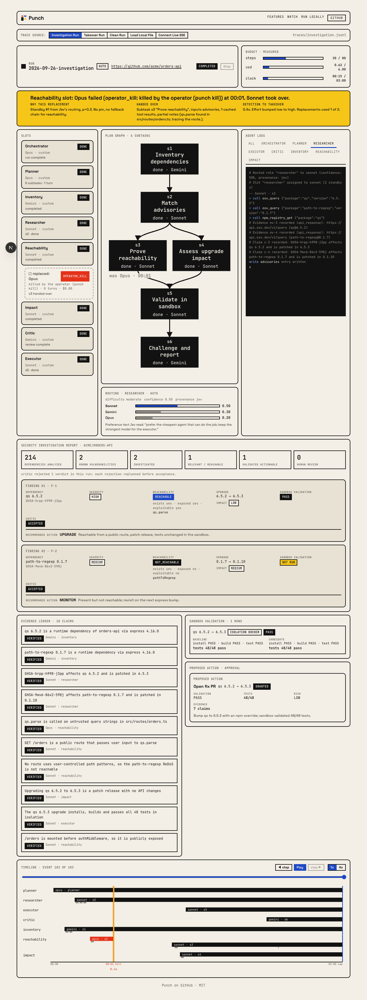

# Punch

Punch is an AI security investigation system for software supply chains. Instead of only listing vulnerable dependencies, it investigates whether a vulnerability actually affects your application, proves reachability, analyzes upgrade impact, and validates the proposed fix in an isolated sandbox. It challenges its own conclusions, recovers automatically when an agent fails, backs every conclusion with an auditable evidence trail, and asks a human before any irreversible action.

**Live site:** https://punch-cyan.vercel.app - replays a recorded takeover run at [/watch/takeover](https://punch-cyan.vercel.app/watch/takeover) with no engine needed, and can drive a local engine (default `http://localhost:4141`) when paired.



## What it does

You give Punch a GitHub repository URL. It works out which known vulnerabilities in the dependencies really matter, and what to do about them.

- **Reachability:** checks whether the vulnerable code can actually be called from your application.
- **Upgrade impact:** estimates what a version bump would break before you make it.
- **Sandbox validation:** runs the baseline and the upgraded code in an isolated environment and compares the test results.
- **Adversarial critic:** a separate agent attacks every finding with 10 challenges. Weak evidence is rejected and sent back for a targeted re-plan.
- **Takeover:** if an agent crashes, stalls or returns garbage, its work is handed to a backup agent from a ranked list, with the context so far.
- **Evidence ledger:** every claim links to the tool calls and files that support it.
- **Human approval:** filing an issue or opening a fix PR waits for an explicit yes.

The full product pitch is in [docs/investigation.md](docs/investigation.md).

## Quickstart

Requires Node 20+ and pnpm 10. Punch is not published to npm; run it from source.

```sh
git clone https://github.com/Mani212005/punch
cd punch
pnpm install
pnpm build
```

### Configure keys and agents

Copy `.env.example` to `.env` for the provider key names. The variables are `ANTHROPIC_API_KEY`, `GEMINI_API_KEY`, `TYPESAFE_API_KEY` (Jev router and critic pre-check) and `GITHUB_TOKEN`. Export the ones you use in your shell.

Agents, providers and routing policy live in `~/.punch/config.json`. Start from [config.example.json](config.example.json), or [config.claude-code.example.json](config.claude-code.example.json) to run on a signed-in Claude Code subscription with no API key. Point at another file with `-c <path>` or the `PUNCH_CONFIG` variable.

```sh
pnpm punch config validate    # schema and env var check
pnpm punch config test        # calls every configured agent and CLI
```

### Run an investigation

```sh
pnpm punch run https://github.com/<owner>/<repo>
pnpm punch run fixtures/runs/clean       # offline replay of a fixture, no keys needed
```

Useful flags: `--budget-usd <usd>` caps spend, `--unattended` auto-denies irreversible actions instead of asking, `--chaos <profile>` injects failures such as `kill-after:<role>:<n>` or `provider-down:<id>` to exercise takeover, and `-c <path>` picks a config. The run writes `runs/<id>/trace.jsonl`.

Other commands: `punch bench <target> --runs <n>` repeats a run and reports cost, latency and takeovers, `punch kill <runId> <slot>` kills the agent in a slot on purpose, and `punch approve` / `punch deny <runId> <approvalId>` answer a pending approval.

### Serve the engine and pair the website

```sh
pnpm punch serve --web-origin https://punch-cyan.vercel.app
```

`serve` listens on `127.0.0.1:4141` (`--port`, `--host`) and prints a pairing token (control) and a viewer token (read-only). `--web-origin` allows the site's origin through CORS; repeat it for more origins, for example `http://localhost:3000` for local `pnpm --filter web dev`. Everything that does work (agents, keys, tool calls) stays on your machine; the site only renders the event stream.

## How the agents work

A router assigns a model to each role and ranks backups. A planner writes a subtask DAG. Inventory, vulnerability research, reachability and upgrade-impact roles run over it and write to a shared blackboard. The critic reviews each finding, the validator runs the upgrade in a sandbox, and the executor files an issue or PR only after approval. Each role sits in a slot with a heartbeat, so a dead or stalled agent is replaced mid-run. Every step is appended to a trace, and the web watch board is a pure function of that trace.

Details, including a walk through one finding, are in [docs/workflow.md](docs/workflow.md).

## Repo layout

- `packages/shared`: Zod schemas and types (config, handoff, trace events, investigation records, API payloads)
- `packages/core`: engine internals (router, roles, run loop, critic, ledger, sandbox, tools, adapters)
- `apps/engine`: the `punch` CLI and the HTTP/SSE server
- `apps/web`: Next.js site (landing page, watch board, report views), deployed on Vercel
- `fixtures/`: recorded runs, sample repos and fake CLIs used by tests and offline replay
- `docs/`: [investigation.md](docs/investigation.md) (product), [workflow.md](docs/workflow.md) (how a run works)
- `plan.md`: build contract; `spec.md`: the challenge; `design/`: visual design

**Live site:** https://punch-cyan.vercel.app - replays the recorded takeover run at [/watch/takeover](https://punch-cyan.vercel.app/watch/takeover) with no engine, and drives a local engine (default `http://localhost:4141`) when paired. Deployed on Vercel (project root `apps/web`, Next.js, pnpm); previews per PR, production from `main`.

## Development

```sh
pnpm typecheck      # tsc --noEmit per package
pnpm lint           # eslint
pnpm test           # vitest per package
pnpm format:check   # prettier
pnpm build
```

`pnpm typecheck && pnpm lint && pnpm test` is the CI gate. `pnpm --filter @punch/core test` runs only the core tests. Live adapter tests (Anthropic, Gemini) are skipped by default. `pnpm install` also sets up a pre-commit hook that formats staged files.

## Status

Merged: the engine and CLI, router, slots with takeover, the adversarial critic, evidence ledger, sandbox validation, fix-PR executor, orchestrator session and approval gate, the bench command, trace rendering, and the web landing page, watch board and report views.

In progress or not merged:

- Dedicated investigation role prompts and the investigation DAG template. The planner on main still describes dependency triage.
- The web console page and `serve --tunnel` for remote viewing.
- Supply-chain anomaly signals (stretch).
